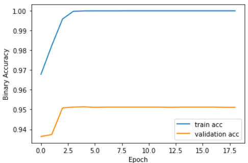
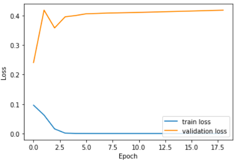
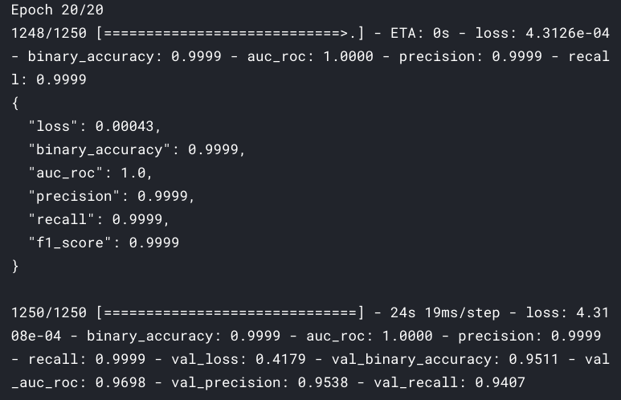
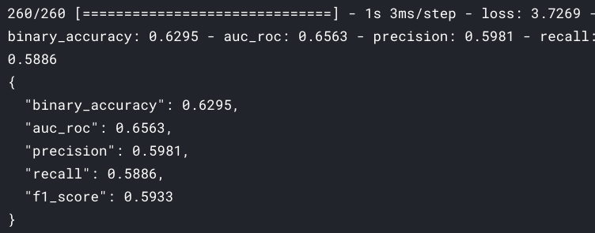
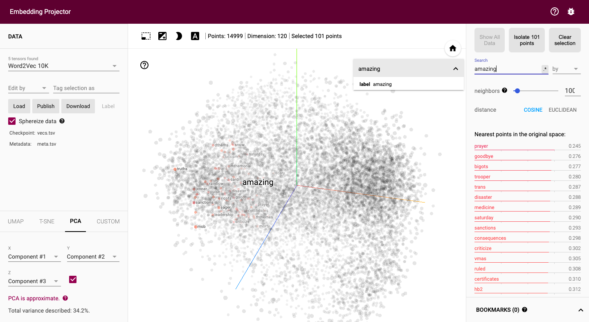
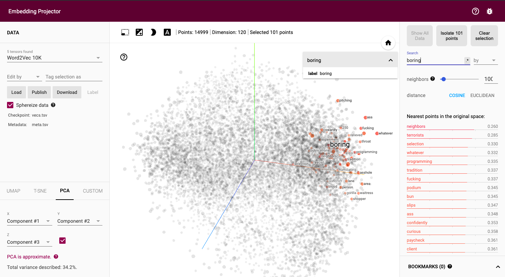
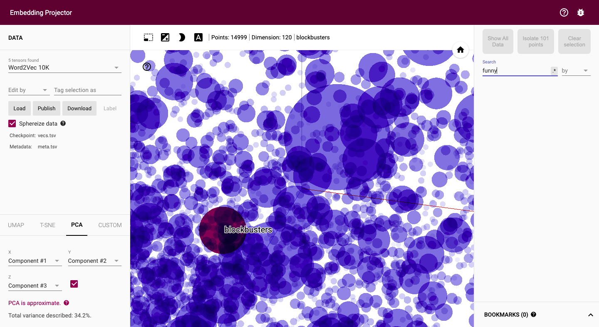

# Classify sentiments in text using Tensorflow

In this project [News Headlines Dataset For Sarcasm Detection](https://www.kaggle.com/rmisra/news-headlines-dataset-for-sarcasm-detection) by [Rishabh Misra](https://www.kaggle.com/rmisra) used to create a deep learning model which will be able to classify a sentence as `sarcastic or not`.

**While doing all of this we will go through:**

- How to `preprocess text` for neural networks
- Importance of `Word Embedding` and how to visualize them using `Tensorflow Projector`
- When to use `GlobalAveragePooling1D` and `Flatten`

## Table of contents

- [Getting started](#getting-started)
- [Deep learning model performance](#deep-learning-model-performance)
- [Visualizing Word Embedding](#visualizing-word-embedding)
- [License](#license)

## Getting started

This deep learning model is trained using `GPU` and to work in the same environment having packages with versions which were used while making this notebook, go to [Kaggle](https://www.kaggle.com/akashsdas/classify-sentiments-in-text-using-tensorflow) where the kernel is saved.

## Deep learning model performance

The dataset is divided into 97% for training, 1.5% for validation and testing respectively. The model is trained for `20 epochs`.

Model's performance on `training` and `validation` datasets.

Model's performance on `testing` dataset.

Model's poor performance on `testing` set might be because of small number of testing samples or our model might be facing `overfitting` issue on `training` and `validation`. So there is room for improvement.

## Visualizing Word Embedding

Visualizing the word embedding learned by the `model` using [Tensorflow Projector](https://projector.tensorflow.org/)

## License

[APACHE LICENSE, VERSION 2.0](./LICENSE)
